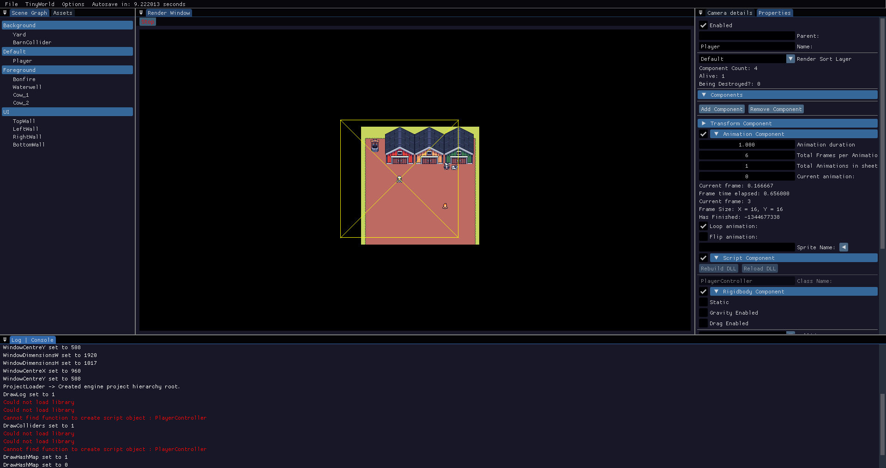
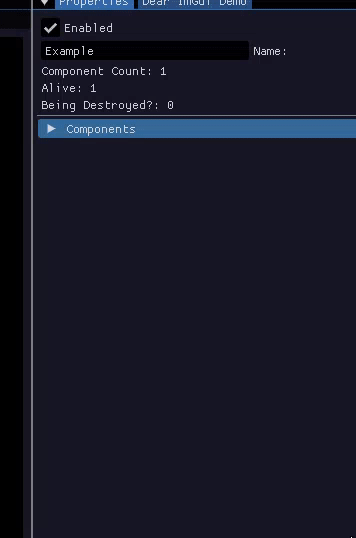
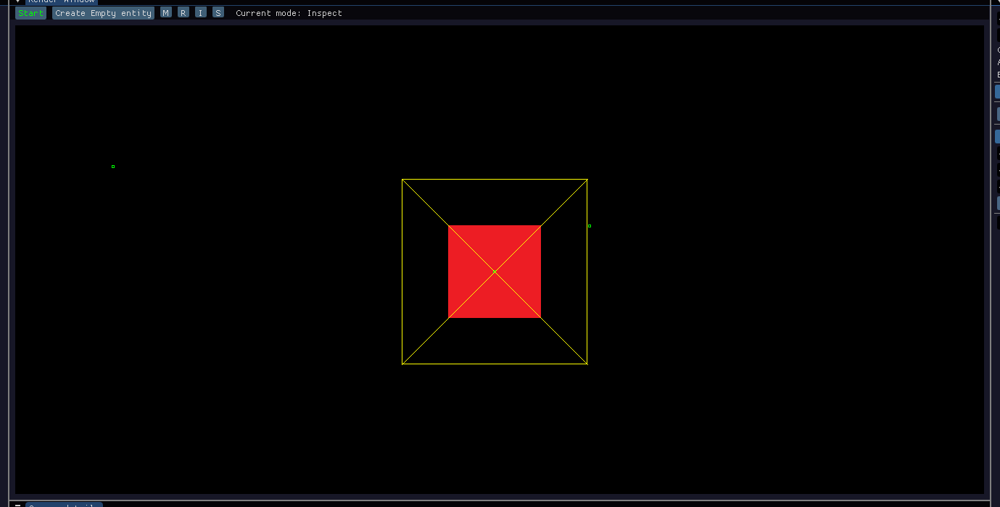
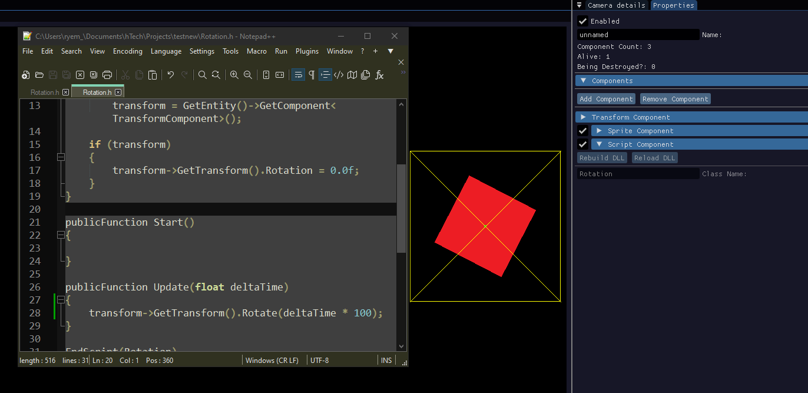

hTech
======

  

 

<!--
![Preview screenshot of the Engine.][Engine_Preview]
-->

### <ins>Info</ins>
The engine is currently good enough to create a very basic play-in-editor game. Given the limitations, I have decided to push what I have been working on to allow this basic game creation ability to main to sort out the
project and repository to a semi-decent state. 

The main branch of the repo is only updated for major changes 
with all active development being done on the '[dev](https://github.com/hallamrear/hTech/tree/dev)' branch. Future planned features, bugs and 
to-do's can all be seen on the [Trello](https://trello.com/b/Q8gTaXio/htech) board.

### <ins>Core Features</ins>

##### Entity Component System

<!--
![Gif showing the ability to add, edit and remove components][ECS_Example_GIF]
-->

    

To build up your game within the engine, you can expand the entities using the various built-in components. Want an animated character? Use an animation component and setup its details. Want that character to have physics? Attach a rigidbody component and enable gravity.

##### Play In Engine

    

As you build your game, you're going to want to test it. Using the start/stop button within the editor you can test your game on the fly, however the changes made during playmode will last when it is stopped unless reset using a ScriptComponent (see the [trello card](https://trello.com/c/87Svp6Wl).

##### Hot-Reloadable Scripts

    

### <ins>References</ins>
#### Physics / Collision
###### [Real Time Collision Detection - Christer Ericson](https://amzn.eu/d/86DKd2p) 
The best book I have found on collision detection. There is so much content in this thing.
###### [Two-Bit Coding](https://www.youtube.com/@two-bitcoding8018)
This man has helped no end with the collision stuff. Having a code example was massively useful in understanding how things work.
###### [Game Physics Engine Development - Ian Millington](https://amzn.eu/d/054DsDO)
This was good up until I realised it didn't actually cover 2d rigidbodies and it was all 3D.
###### [Physics for Game Developers 2e - David M Bourg](https://amzn.eu/d/bK5nYAA)
This was the second attempt to find a good book book to replace GPED and this covered alot of the right stuff but there were alot of formulas that felt unnecessary but it was indepth.
#### External Code
###### [SDL2](https://libsdl.org/)
The core of the engine is currently built upon SDL2 for input capture and rendering.
###### [DearIMGUI](https://github.com/ocornut/imgui)
The editor windows are all using DearIMGUI, specifically the docking branch to allow for users to move them around.
###### [Build Counter](https://github.com/nothke/build-number-increment)
I used [nothke](https://twitter.com/Nothke/)'s build increment scripts in my pre-build step.

[Engine_Preview]: ./README_Images/Engine_Preview.png "Preview screenshot of the Engine"
[ECS_Example_GIF]: ./README_Images/ECS_Example.gif